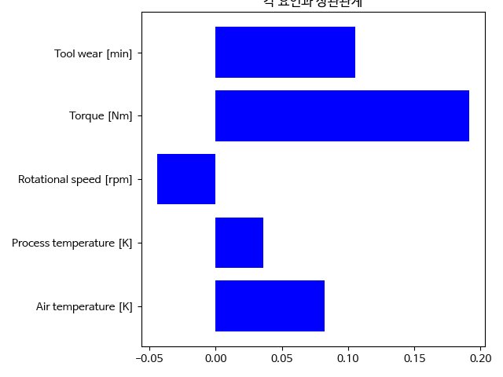
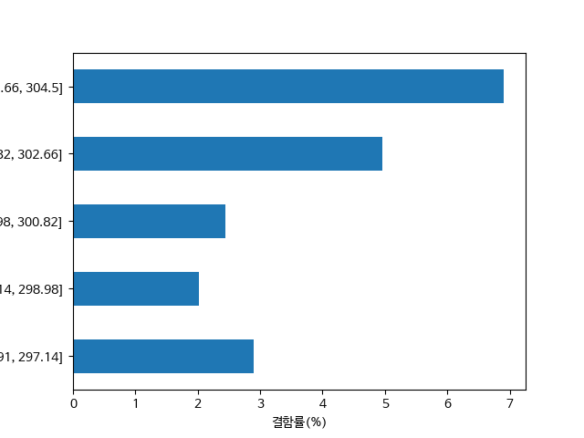
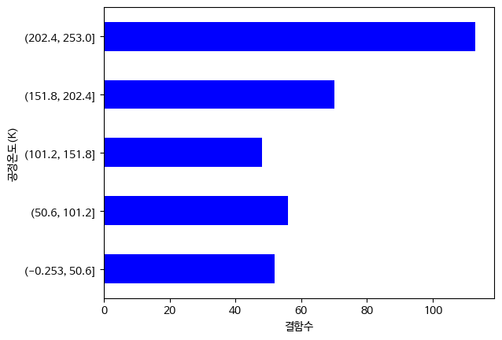
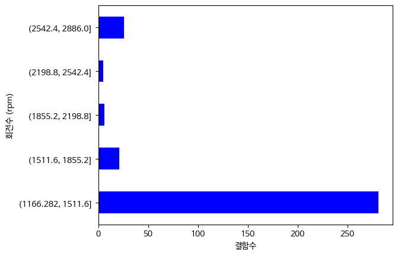
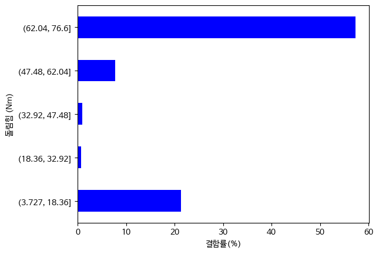

1. 프로젝트 개요

밀링 머신 공정 관련 데이터 Predictive Maintenance Dataset (AI4I 2020)를 분석하여 
각 공정 조건과 기계 failure 발생 관계에 대해 분석 하였다

각 변수 구간별 failure 발생률을 확인하고
randomforestclassifier를 사용하여 기계의 failure 발생 여부를 학습시킨 모델로 failure 여부를 예측 할 수있는지 확인하였고
featureimportance를 통해 어떤 변수의 영향이 큰지 예측 및 분석 하였다

2.data
dadta: Predictive Maintenance Dataset (AI4I 2020) 
address: https://www.kaggle.com/datasets/stephanmatzka/predictive-maintenance-dataset-ai4i-2020/data
데이터 수 :10000
고장수:339
예측 목표: failure
0:정상
1:고장

변수
- Air Temperature [K]
- Process Temperature [K]
- Rotational Speed [rpm]
- Torque [Nm]
- Tool Wear [min]

udi, product id, type은 공정에 관련 없다는 판단 하에 제거

분석 과정
1. 각 공정 변수와 고장 발생 상관관계를 확인

2. 각 변수를 여러 구간으로 나누어 구간별 고장률 비교

- Air Temperature
- 
- Process Temperature
- 
- Rotational Speed
- 
- Torque
- 
- Tool Wear
- 

공기온도는 6.9 퍼센트로 약 302.5도에서 304.5도 사이에서 

공구사용시간은 16.8 퍼센트로 약 202.4에서 253분 사이에서 

돌림 힘은 57퍼센트로 62 76.6 사이에서 

회전 수는 86퍼센트로 2542 2886 사이에서

공정 온도는 16퍼로 202.4 253 가장 높게 결함률이 나왔

       
