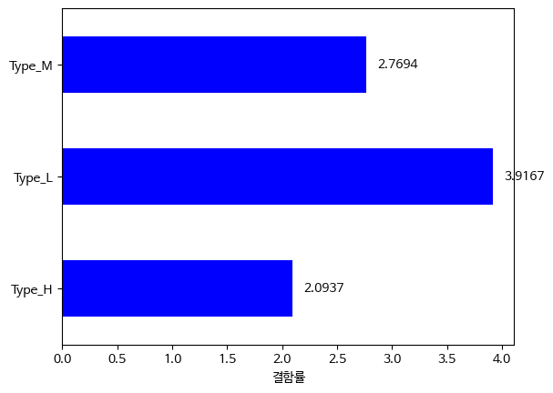
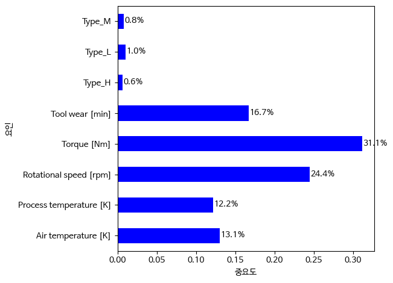

1. 프로젝트 개요

밀링 머신 공정 관련 데이터 Predictive Maintenance Dataset (AI4I 2020)를 분석하여 
각 공정 조건과 기계 failure 발생 관계에 대해 분석 하였다
failure은 모든 종류를 통틀어서 합쳐서 두었다

각 변수 구간별 failure 발생률을 확인하고
randomforestclassifier를 사용하여 기계의 failure 발생 여부를 학습시킨 모델로 failure 여부를 예측 할 수있는지 확인하였고
featureimportance를 통해 어떤 변수의 영향이 큰지 예측 및 분석 하였다

2.data
dadta: Predictive Maintenance Dataset (AI4I 2020) 
address: https://www.kaggle.com/datasets/stephanmatzka/predictive-maintenance-dataset-ai4i-2020/data
데이터 수 :10000
고장수:339
예측 목표: failure
0:정상
1:고장

변수
- type
- Air Temperature [K]
- Process Temperature [K]
- Rotational Speed [rpm]
- Torque [Nm]
- Tool Wear [min]

udi, product id는 공정에 관련 없다는 판단 하에 제거

3.분석 과정
각 공정 변수와 고장 발생 상관관계를 확인

각 타입별 고장률 비교
-type
- 

  L타입에서 가장 결합률이 크게 나온다

타입 분석에서 결합률로 한 이유는 타입별 셈플 수가 다르기 때문에 비율로 하였다

각 변수를 여러 구간으로 나누어 구간별 고장수 비교
- Air Temperature
- 
- Process Temperature
- 
- Rotational Speed
- 
- Torque
- 
- Tool Wear
- 

공기온도는  약 302.5도에서 304.5도 사이에서 

공구사용시간은  약 202.4에서 253분 사이에서 

돌림 힘은  62 76.6 사이에서 

회전 수는  2542 2886 사이에서

공정 온도는  202.4 253 가장 높게 고장 발생 횟수가 나왔다

random forest classification

4.각 변수의 복합적인 영향이 failure에 어떻게 미치는가를 random forest classification을 사용하여 알아본다

input:5개 변수

target:failure

train/test split

stratify=target을 사용하여 고장 수가 매우 작기 때문에 test/train에 들어갈 고장 정상 비율 유지
또한 precision recall f1-score를 확인

precision=0.83

recall=0.56

f1-score=0.67

모델이 고장이라고 판명한 것 중에 진짜 고장 비율이 0.77

실제 고장 중에 모델이 고장이라고 찾은 비율이 0.59

해당 데이터로 학습한 모델이 높지 않은 정확도를 보여준다

feature importance
- 
feature importance로 이 모델에서 고장 발생하는 데에 가장 영향을 많이 준다고 판단한 변수는  torque 이다 

하지만 torque  failure에 필연적으로 인과관계를 가진다고 판단하지 않는다

5.결론

개별 변수 구간에 따른 고장 발생 수 비교 결과  

높은 구간에서만 또는 낮은 구간에서 만에서 고장 발생 횟수가 높다고 할 수 없으며 또한 적정 구간이 있다고 판단이 가능

타입 별 고장에 영향을 주는 것은 각 타입별 차이가 미미함

각 변수가 복합적으로 고장에 영향을 어떻게 미칠까 알기 위해 random forest를 사용한 결과 torque가 상대적으로 중요한 변수로 나타났다

전체 셈플에 비해 target 셈플이 적기 때문에 recall과 precision을 사용하였지만 recall이 높지 않은 값으로 인해 실질적으로 예측하는데 어느정도 한계가 있다

따라서 본 분석에서 특정 변수에서 각 구간에 따른 발생 횟수 분석과 주어진 데이터로 5개의 변수의 상대적 중요도와 failure분류할 수 있는 가능성에 대해 생각할 수 있는 데 의의를 두었다

6.한계점 

전체 셈플 중에 고장 수가 적어 고장여부를 판단하는 학습을 하는 것에 한계가 있다

feature importance로 판단한 변수가 기여도를 나타내지만 실제 인과관계를 나타내지 않는다

해당 데이터는 실제 수집 데이터가 아닌 Synthetic Dataset이다

       
